

<h1>Atlantic Equatorial Mode Study</h1>

El <b>Atlantic Equatorial Mode</b>, también conocido como <b>Atlantic Niño</b>, es un patrón de
variabilidad climática caracterizado por anomalías positivas de la temperatura superficial
del mar (<b>SST</b>) en el Atlántico ecuatorial oriental. Aunque comparte ciertos mecanismos
físicos con el <b>El Niño–Southern Oscillation (ENSO)</b> del Pacífico, el Atlantic Niño
presenta una <b>menor intensidad</b>, una <b>duración más corta</b> y un
<b>carácter marcadamente estacional y regional</b>.
  

Este estudio tiene como objetivo <b>caracterizar observacionalmente el Atlantic Niño</b> y
compararlo de forma sistemática con el <b>Pacific Niño</b>, analizando sus diferencias en
estructura temporal, extensión espacial e impacto atmosférico. Para ello, se estudia la
variabilidad mensual, la distribución espacial de las anomalías de <b>SST</b> y
<b>precipitación</b>, y la relación entre ambos campos durante el período
<b>1960–2020</b>.
  

Un aspecto central del trabajo es la <b>definición robusta de criterios de identificación
de eventos</b>, prestando especial atención a la <b>estacionalidad característica</b> del
Atlantic Niño y a su <b>independencia respecto al ENSO</b>. Dado que el calentamiento global
introduce una tendencia de fondo en las series de SST, se adopta un enfoque basado en
<b>anomalías estacionales</b>, evitando sesgos hacia años recientes y garantizando una
interpretación físicamente consistente de los episodios detectados.
  

El análisis combina múltiples bases de datos observacionales y de reanálisis, permitiendo
evaluar la <b>robustez de los resultados</b> frente a diferencias metodológicas y asegurar
que los patrones identificados no dependen de un único producto.

<b>Bases de datos</b>  

Para el análisis de la temperatura superficial del mar (<b>SST</b>) se utilizan dos productos
observacionales ampliamente empleados en estudios climáticos:
<ul>
  <li><b>HadISST</b>, con resolución espacial de <b>1° × 1°</b>.</li>
  <li><b>ERSST</b>, con resolución espacial de <b>2° × 2°</b>.</li>
</ul>

Para la precipitación se emplean dos productos con distinta naturaleza (observacional y
reanálisis), lo que permite evaluar la robustez de las señales atmosféricas:
<ul>
  <li><b>NOAA precipitation (PCP)</b>, con resolución espacial de <b>2.5° × 2.5°</b>.</li>
  <li><b>NCEP–NCAR Reanalysis (precipitación)</b>, con resolución espacial de
      <b>1.875° × 1.875°</b>.</li>
</ul>

El período de estudio abarca <b>1960–2020</b>, seleccionado por la mayor calidad y
homogeneidad de los registros observacionales.

---

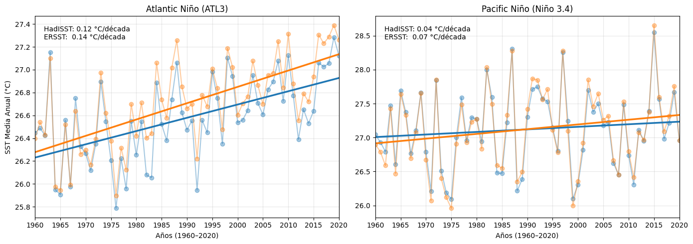

---

<b>Temperatura media anual y metodología de cálculo</b>  
Se muestran dos gráficas correspondientes a la temperatura media anual en las regiones del 
<b>Atlantic Niño (ATL3)</b> y del <b>Pacific Niño (Niño 3.4)</b>.
En ambas regiones se observa una <b>clara tendencia positiva</b> de la temperatura a lo largo del periodo de estudio.
Dado que esta señal está asociada al calentamiento global, es necesario aplicar un 
<b>detrend</b> previo al cálculo de las anomalías climáticas.
Además, puesto que la magnitud de la tendencia difiere entre regiones, este detrend debe aplicarse
<b>punto a punto</b> en cada celda espacial.

Las dos bases de datos analizadas,
<b>HadISST</b> y
<b>ERSST</b>,
presentan resultados coherentes con lo esperado.
ERSST muestra sistemáticamente valores ligeramente más elevados, aunque dentro de un margen razonable.
Estas diferencias se explican por el distinto sistema de observación, la frecuencia temporal,
la resolución espacial y las metodologías de reconstrucción empleadas en cada producto,
lo que introduce un pequeño <i>offset</i> entre ambas bases de datos.

Se descartan los valores de temperatura superiores a <b>35&nbsp;°C</b> para evitar la contaminación por puntos de tierra,
así como los valores inferiores a <b>−1.79&nbsp;°C</b>.
Este último umbral es especialmente relevante en ERSST, donde la región cubierta por hielo en el Ártico
presenta valores cercanos a −1.8&nbsp;°C que distorsionan la media y los cálculos posteriores.

Para el cálculo de la temperatura media en cada región se ha utilizado inicialmente
la media directa de la matriz de datos.
No obstante, esta aproximación no es estrictamente correcta, ya que el área representada por cada celda
depende de la latitud. La forma físicamente correcta de calcular la media espacial es ponderar cada celda
por el coseno de la latitud.
Esta ponderación es necesaria porque la Tierra es una esfera y el área de las celdas disminuye con la latitud.
Para latitudes bajas, como las consideradas en este estudio, el error cometido al no aplicar esta corrección
es muy reducido (del orden del <b>0.5&nbsp;%</b>), por lo que la aproximación resulta aceptable.

De forma análoga, en el cálculo inicial se han utilizado los índices directos de la malla
en lugar de interpolar exactamente los límites geográficos de cada región.
Esto puede introducir pequeñas discrepancias, pero dado que las áreas analizadas son amplias
y se encuentran próximas al ecuador, el impacto debido al cambio de latitud (coger valores de latitud diferentes porque estan en nuestra malla) es mínimo. Además no estudiar las zonas exactas por decimas de grados no es un problema ya los gradientes meridionales cerca del ecuador son suaves.

En la siguiente celda se repite el cálculo sin ninguna de estas aproximaciones
(interpolación espacial de lo limites exactos geograficos y media espcial ponderada por coseno de la latitud)
con el objetivo de verificar cuantitativamente que las diferencias introducidas son despreciables.

---

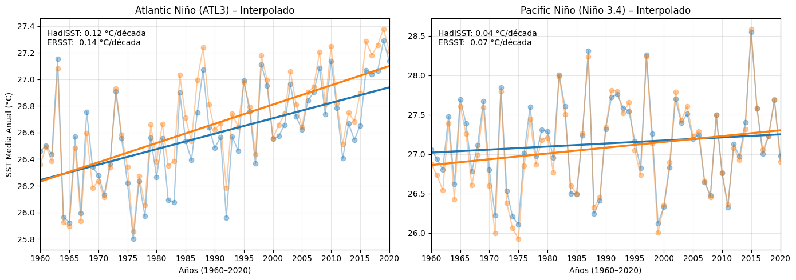

---

<b>Nota metodológica.</b>  

Como ya habíamos anticipado, la interpolación espacial no es estrictamente necesaria para las regiones de estudio consideradas. El área efectiva de cada celda depende del coseno de la latitud; dado que nuestras regiones se extienden como máximo hasta ±5°, este factor toma valores cercanos a 0.996. En consecuencia, el error relativo introducido por no ponderar el área es inferior al 0.4 % incluso en el peor de los casos.

Este efecto no altera las tendencias estimadas y únicamente introduce diferencias muy pequeñas en los valores máximos, siempre inferiores a 0.1 °C. Aun así, y por consistencia metodológica, emplearemos definiciones de media ponderada por área y mantendremos el mismo criterio de selección de índices utilizado anteriormente.

La selección directa por índices resulta más sencilla y robusta, ya que evita depender de la estructura exacta de las coordenadas originales de cada conjunto de datos. Para homogeneizar todos los productos, utilizaremos la función <code>interp2d_to_target</code> para interpolar los campos a una malla común con las siguientes características:

<ul style="margin-top:8px;">
  <li>Longitud: −180° a 180°</li>
  <li>Latitud: −90° a 90°</li>
  <li>Resolución espacial: <code>ddeg = 0.25°</code></li>
</ul>

---

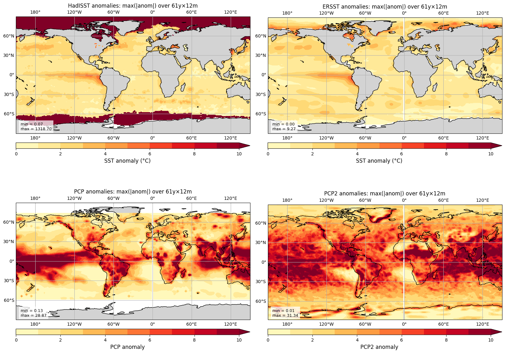

---

Esta figura se utiliza para evaluar la presencia de valores atípicos (outliers) en las anomalías de temperatura superficial del mar correspondientes a cada base de datos. Se observa que, en el caso de **HadISST**, las regiones polares presentan anomalías extremadamente intensas y físicamente inconsistentes. En particular, aparecen valores máximos de anomalía del orden de **1318 °C**, lo cual carece de sentido físico y evidencia la presencia de errores en esta base de datos que deben ser filtrados previamente al análisis.

Por el contrario, en las otras tres bases de datos analizadas no se identifican valores anómalos comparables, mostrando un comportamiento consistente y físicamente razonable en todo el dominio espacial. En este contexto, resulta adecuado aplicar un umbral de filtrado de **±10 °C**, dado que la anomalía máxima observada en un punto a lo largo de todo el periodo analizado es de **9.27 °C**, lo que garantiza la eliminación de valores espurios sin afectar a la señal climática real.

---

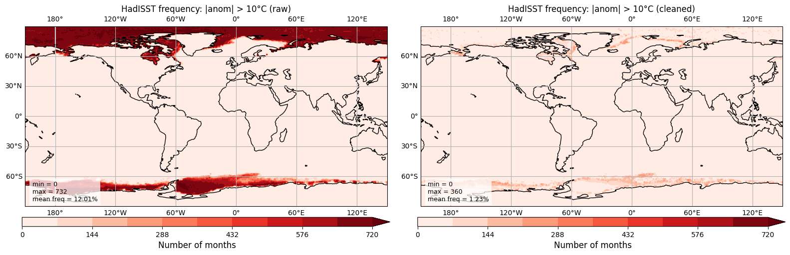

---

En este paso se aplica un filtrado global que elimina las anomalías con valores absolutos superiores a **±10 °C**. Este umbral se adopta en base a criterios físicos y empíricos, dado que la anomalía máxima observada en un punto a lo largo de todo el periodo analizado es de **9.27 °C**. De este modo, el filtrado elimina valores espurios asociados a errores en los datos sin afectar a la señal climática real.

La aplicación de este criterio reduce de forma significativa la presencia de anomalías extremas físicamente inconsistentes, permitiendo obtener mapas espaciales coherentes y comparables entre las distintas bases de datos analizadas.

---

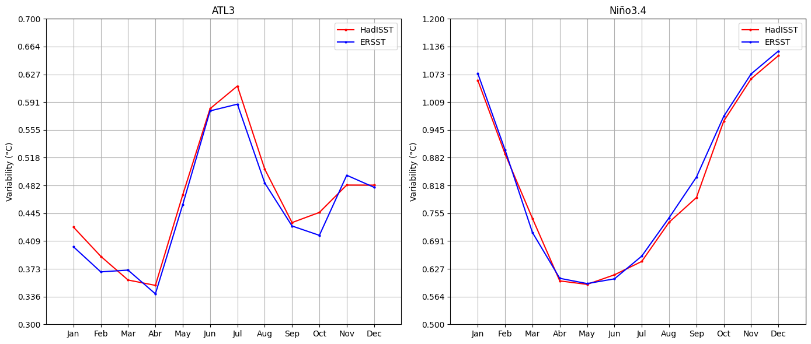

---

<b>Variabilidad media mensual de las SST (61 años)</b>  
Aquí se muestra la variabilidad media de las anomalías de SST calculada a partir de 61 años de datos,
para cada mes del año, en las regiones <b>ATL3</b> y <b>Niño3.4</b>, comparando las bases de datos 
<b>HadISST</b> y 
<b>ERSST</b>.

Esta variabilidad identifica los periodos del año en los que los fenómenos océano-atmosféricos
presentan mayor intensidad:

<ul>
<li>
<b>Atlantic Niño (ATL3):</b>
máxima actividad durante el verano boreal, con picos en
<b>junio y julio</b>.
</li>

<li>
<b>Pacific Niño (Niño3.4):</b>
máxima actividad durante el invierno boreal, con picos en
<b>diciembre y enero</b>.
</li>
</ul>

Las diferencias entre ambas bases de datos se encuentran dentro de lo esperado.
En el caso de ATL3, 
HadISST presenta picos y mínimos ligeramente más elevados
que ERSST.

La separación <b>relativa</b> entre 
HadISST y 
ERSST
es mayor en el Atlantic Niño, lo que se aprecia visualmente en el gráfico.
En contraste, el Niño del Pacífico muestra una señal mucho más similar entre ambas bases de datos.

No obstante, en términos absolutos, las diferencias entre HadISST y ERSST son comparables en ambos
casos (≈ 0.05 °C). Por tanto, ATL3 no es más inconsistente en terminos absolutos, es solo que el mismo sesgo de datos
tiene un mayor peso relativo cuando la variabilidad climática es menor.

---

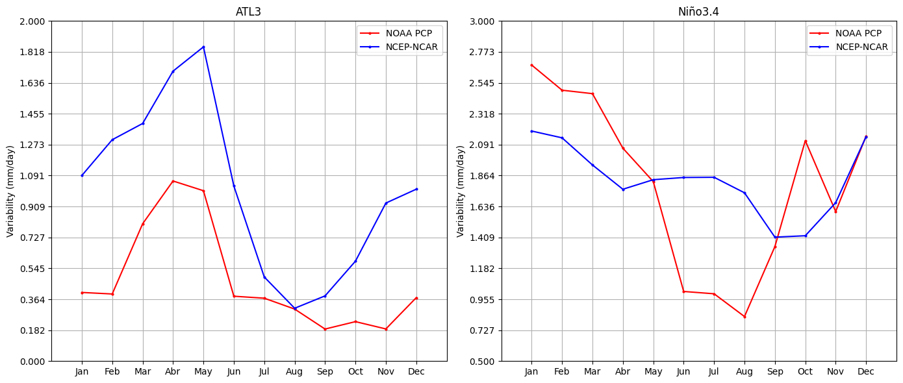

---

A diferencia de la SST, la variabilidad mensual de la precipitación muestra una mayor dependencia del producto utilizado. NOAA PCP y NCEP-NCAR presentan ciclos estacionales coherentes en ATL3 y Niño-3.4, pero con diferencias notables en amplitud y fase, especialmente en el Pacífico ecuatorial. Estas discrepancias son esperables dada la naturaleza altamente no lineal de la precipitación y las limitaciones de los reanálisis antiguos en regiones tropicales.

---

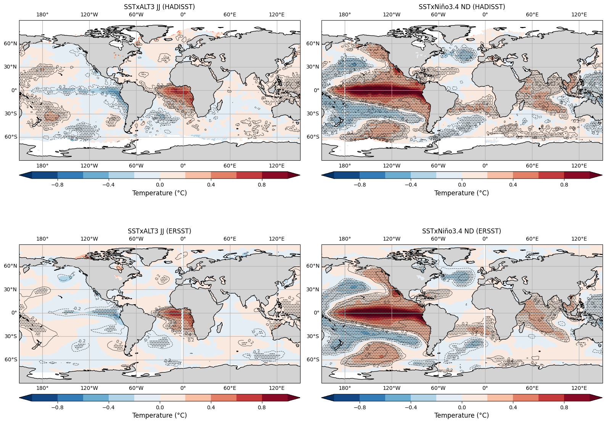

---

En los paneles correspondientes al <b>Atlantic Niño</b> (izquierda, <b>JJ</b>) se observa
un calentamiento <b>muy localizado</b> en el <b>Atlántico ecuatorial</b>, claramente
<b>centrado en la región ATL3</b>.
La amplitud de las anomalías es <b>moderada en términos absolutos</b> y sensiblemente
<b>menor que la asociada al ENSO</b>.
El patrón espacial es fundamentalmente <b>regional</b> y no domina el resto de las
cuencas oceánicas.
Las áreas punteadas indican regiones con <b>significancia estadística</b>, aunque su
extensión espacial es <b>limitada</b>, lo que refuerza el carácter localizado y estacional
del fenómeno.
En conjunto, el Atlantic Niño se manifiesta como un evento <b>estacional, regional y de
escala espacial reducida</b>, sin evidenciar <b>interconexiones globales robustas</b>.
  

Por el contrario, en los paneles correspondientes al <b>Pacific Niño / ENSO</b>
(derecha, <b>ND</b>) se aprecia un calentamiento <b>mucho más intenso</b> en el
<b>Pacífico ecuatorial</b>, caracterizado por la presencia de la <b>típica lengua cálida
ecuatorial</b>.
La señal se <b>extiende ampliamente</b> a lo largo del Pacífico tropical y presenta
<b>impactos claros en otras cuencas oceánicas</b>.
El patrón espacial es más <b>simétrico zonalmente</b> y claramente
<b>dominante a escala global</b>.
Las regiones punteadas cubren áreas extensas, confirmando la <b>robustez estadística</b>
del patrón asociado al ENSO.
En este sentido, el Pacific Niño se identifica como el <b>principal modo de variabilidad
interanual tropical</b>, caracterizado por la presencia de <b>interconexiones a escala
global</b> que modulan la variabilidad climática en múltiples regiones del planeta.

---

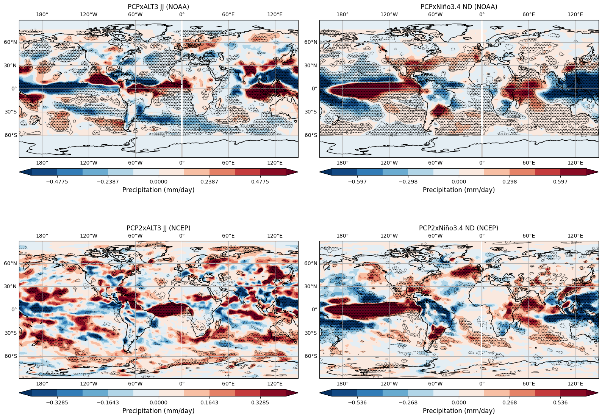

---

En los paneles correspondientes al <b>Atlantic Niño</b> (izquierda, <b>JJ</b>), tanto en la
base de datos de <b>NOAA</b> como en <b>NCEP</b>, se observan anomalías de precipitación
<b>concentradas principalmente en el Atlántico ecuatorial</b> y regiones adyacentes.
El patrón de lluvia presenta una estructura predominantemente <b>regional</b>, con
señales coherentes en la franja ecuatorial atlántica, pero con una
<b>extensión espacial limitada</b>.
Las áreas punteadas indican regiones con <b>significancia estadística</b>, que se
restringen mayoritariamente al Atlántico tropical y zonas continentales próximas.
Este comportamiento refuerza la interpretación del Atlantic Niño como un fenómeno
<b>acoplado océano–atmósfera de alcance regional</b>.
  

No obstante, los mapas muestran que el <b>Atlantic Niño</b> puede inducir
<b>respuestas atmosféricas remotas secundarias</b>, visibles en forma de anomalías de
precipitación más débiles en otras regiones, como el <b>Pacífico tropical</b>
(anomalías negativas), <b>Sudamérica austral</b> y sectores del <b>Índico y Sudeste
Asiático</b>.
Estas señales presentan una distribución espacial <b>más irregular y fragmentada</b>,
con menor coherencia entre regiones y una <b>robustez estadística más limitada</b>,
además de una mayor dependencia del evento concreto y de la base de datos utilizada.
  

Por el contrario, los paneles correspondientes al <b>Pacific Niño / ENSO</b>
(derecha, <b>ND</b>) muestran anomalías de precipitación <b>mucho más intensas y
espacialmente extensas</b>, dominadas por la <b>típica lengua húmeda ecuatorial</b> en el
Pacífico.
Este calentamiento oceánico induce una <b>respuesta atmosférica altamente organizada</b>,
con compensaciones claras entre regiones, como el patrón característico de
<b>Pacífico central húmedo</b> y <b>regiones de Asia y el Pacífico occidental más secas</b>.
Las áreas punteadas cubren <b>amplias regiones del globo</b>, confirmando la
<b>robustez estadística</b> y la consistencia del patrón entre datasets.
  

Estas diferencias ponen de manifiesto que la distinción clave entre ambos fenómenos
<b>no reside en la presencia o ausencia de respuestas remotas</b>, sino en su
<b>coherencia, organización y dominancia dinámica</b>.
El <b>ENSO</b> genera <b>teleconexiones climáticas robustas y repetibles</b>, asociadas a
una <b>reconfiguración clara de la circulación de Walker</b> y a ajustes en la
circulación de <b>Hadley</b>, dando lugar a una reorganización global del campo de
precipitación.
  

El <b>Atlantic Niño</b>, en cambio, puede inducir respuestas remotas, pero estas son
<b>más débiles, menos simétricas, menos persistentes</b> y
<b>no dominantes frente a la variabilidad interna del sistema climático</b>.
Esta diferencia dinámica constituye la <b>justificación física</b> para exigir, en la
identificación de eventos de <b>Atlantic Niño</b>, la <b>independencia respecto al ENSO</b>.
Incluso cuando se cumplen criterios térmicos y temporales en <b>ATL3</b>, la presencia
simultánea de un ENSO activo puede dar lugar a respuestas atmosféricas inducidas,
generando <b>falsos positivos</b> si no se considera explícitamente el estado del
Pacífico.

---

<b>Identificación de años de máxima intensidad térmica</b>  

En esta sección se identifican los <b>cinco años con mayores picos de temperatura</b> en las regiones
<b>Niño&nbsp;3.4</b> y <b>ATL3</b> durante el periodo 1960–2020.
Dado que los episodios de calentamiento asociados a estos fenómenos presentan una recurrencia
característica, los máximos térmicos detectados pueden interpretarse como
<b>indicadores de la posible ocurrencia de eventos Niño</b> en cada una de las regiones.
  
Estos años se utilizan posteriormente para analizar si efectivamente se produjeron
eventos de <b>Pacific Niño</b> en la región Niño&nbsp;3.4 y de <b>Atlantic Niño</b> en la región ATL3,
así como para investigar posibles interacciones entre ambos sistemas.
Cabe destacar que los <b>picos térmicos, por sí solos, no constituyen una prueba concluyente</b>
de la ocurrencia de estos eventos.
Sin embargo, mediante el análisis de las anomalías de SST y su comparación con la
<b>variabilidad media mensual</b> característica de cada región,
es posible determinar si dichos años corresponden efectivamente a episodios Niño.
Este enfoque permite profundizar en la detección y caracterización de estos eventos climáticos
de forma robusta y consistente.

<b>Caracterización de la intensidad del evento</b> 

La relación entre la media de anomalías en los meses de pico y la desviación estándar
(interanual) se utiliza para calcular un índice estandarizado <b>Z</b>, que permite evaluar
tanto la intensidad como la rareza del evento, una vez verificado que las distribuciones
presentan una normalidad estadística razonable.
Se adopta la siguiente clasificación:
<ul>
<li><b>Z &lt; 0.5:</b> evento no considerado como caso de estudio.</li>
<li><b>0.5 ≤ Z &lt; 1.0:</b> evento débil.</li>
<li><b>1.0 ≤ Z &lt; 1.5:</b> evento moderado.</li>
<li><b>Z ≥ 1.5:</b> evento fuerte.</li>
</ul>

---

---

Aunque en muchos estudios se asume directamente la normalidad de los datos, en este trabajo
se ha comprobado explícitamente que, para los <b>61 años</b> analizados y para los meses
<b>JJ</b> y <b>ND</b> de cada serie, las anomalías presentan una
<b>tendencia aproximadamente gaussiana</b>.
En el caso del <b>Niño del Atlántico</b> el ajuste a la distribución normal es más claro,
aunque ambas series se mantienen dentro de un régimen de
<b>normalidad estadística razonable</b>.
  

Esta verificación resulta relevante, ya que permite cuantificar de forma consistente
la <b>rareza de las anomalías térmicas</b>.
Los valores representados en el histograma indican la frecuencia con la que se producen
determinadas anomalías medias en cada región y conjunto de meses, considerando un valor por año.
Como es esperable en una distribución aproximadamente normal, la frecuencia disminuye hacia
los extremos, reflejando que las anomalías más intensas son menos comunes.
  

En el contexto de este estudio, el interés se centra principalmente en las
<b>anomalías positivas</b>, dado que tanto el <b>Pacific Niño</b> como el
<b>Atlantic Niño</b> se caracterizan por aumentos de la temperatura superficial del mar.
Por este motivo, el análisis de la cola positiva de la distribución resulta especialmente relevante.
  

Los <b>percentiles 84 y 90</b> constituyen medidas estadísticas útiles para evaluar la
rareza de un evento, ya que indican los valores a partir de los cuales solo se encuentran
el <b>16&nbsp;%</b> y el <b>10&nbsp;%</b> de los casos, respectivamente.
Estos umbrales permiten contextualizar la intensidad de un evento concreto dentro de la
variabilidad histórica de la región y facilitan la identificación de episodios
excepcionalmente intensos.

---

<b>Metodlogia para eventos Pacific Niño</b>  

Para el caso del ENSO, se adopta la convención del <b>ONI (Oceanic Niño Index)</b> definida por la NOAA:
<ul>
<li><b>Umbral:</b> anomalía ≥ 0.5&nbsp;°C en la región Niño&nbsp;3.4.</li>
<li><b>Duración:</b> al menos 5 trimestres móviles consecutivos (medias solapadas de 3 meses).</li>
</ul>
Además de determinar los eventos, buscamos saber su <b>intensidad</b> a partir de los meses de máximo desarrollo
(<b>noviembre–diciembre</b>), calculando la media de las anomalías en dichos meses y
comparándola con su <b>desviación estándar interanual</b> en esos meses.
De esta relación se obtiene el índice estandarizado <b>Z</b>, utilizado previamente para las funciones que clasifican la intensidad del evento.
  

Desde un punto de vista cualitativo, se espera que, en presencia de un evento,
la forma del gráfico reproduzca la <b>variabilidad temporal característica</b> del Pacific Niño,
con anomalías interanuales concentradas en el invierno boreal y picos en los últimos meses
del primer año. Cuando los máximos se producen en los meses esperados y la evolución temporal
es consistente, el evento se clasifica como <b>canónico</b>.
  

No obstante, pueden darse casos que cumplan estrictamente el criterio del ONI pero presenten
una evolución temporal distinta. En estos casos, el evento no se considera canónico,
aunque <b>sigue siendo clasificado como evento Niño</b>.

Para facilitar la identificación de estas situaciones, se representan las anomalías en un
intervalo de <b>dos años consecutivos</b>, es decir, se realiza el gráfico de dos años seguidos,
lo que permite visualizar correctamente la transición y el desarrollo temporal del fenómeno.

Pueden existir eventos de mayor duración, en los que el criterio de cinco trimestres móviles
consecutivos se extiende más allá de dos años. En estos casos, los meses de máximo desarrollo
pueden no coincidir con la climatología esperada, reforzando su carácter no canónico.
Para analizar adecuadamente estos eventos, es necesario aplicar la función en dos intervalos
solapados (años 1–2 y años 2–3), con el fin de reconstruir su evolución completa.

Dado que los picos térmicos no coinciden necesariamente con los meses típicos, la comparación
con la desviación estándar resulta menos directa. No obstante, se mantiene un criterio homogéneo
y se evalúan las anomalías en los meses de <b>noviembre–diciembre</b>, aun cuando estos no
correspondan exactamente a los picos máximos del evento.

Como enfoque alternativo, podría compararse directamente el valor máximo de anomalía del evento
con los máximos de la desviación estándar, independientemente del momento del año en que se
produzcan. <b>Este enfoque alternativo no se realiza en la presente función</b> y se lo menciono únicamente
como una posible extensión metodológica, especialmente relevante para eventos no canónicos
o de duración prolongada.

Todos estos cálculos —detección del evento, intensidad y valor de Z— se realizan de forma
consistente para ambas bases de datos empleadas (<b>HADISST</b> y <b>ERSST</b>).

---

#Posible ENSO entre 1972-1973

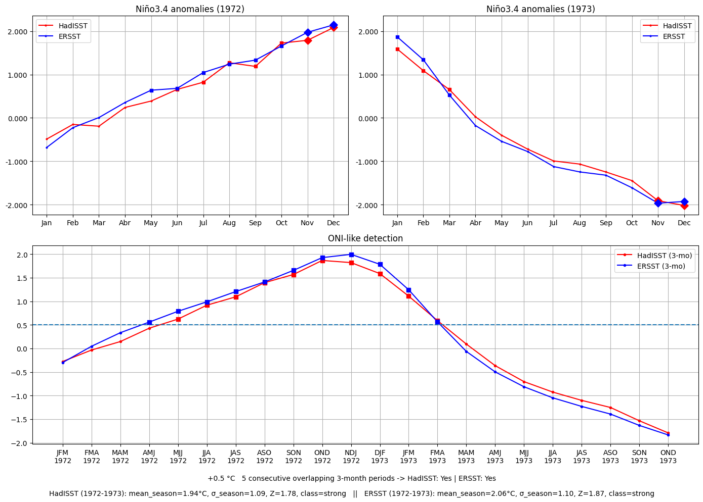

---

Entre <b>1972 y 1973</b> se identifica un claro caso de <b>Pacific Niño canónico</b>.
La evolución temporal de las anomalías coincide con la forma esperada del fenómeno,
con máximos concentrados a finales de año, y se observan hasta
<b>11 trimestres móviles consecutivos</b> con anomalías superiores a <b>0.5&nbsp;°C</b>,
cumpliendo ampliamente el criterio del ONI.
  

La temperatura media en los meses de máximo desarrollo es del orden de
<b>2&nbsp;°C</b>, y el índice estandarizado <b>Z</b> alcanza un valor cercano a <b>1.8</b>,
lo que sitúa este episodio en el límite superior de la categoría de
<b>eventos fuertes</b>

Asimismo, el evento se encuentra claramente por encima del
<b>percentil 90</b> (<b>0.911&nbsp;°C</b>), lo que indica que anomalías de esta magnitud
se producen en menos del <b>10&nbsp;%</b> de los años analizados,
confirmando su carácter excepcional dentro del período de estudio.

---

#Posible ENSO entre 1982-1983

---

Entre <b>1982 y 1983</b> se identifica un claro caso de <b>Pacific Niño canónico</b>.
La evolución temporal de las anomalías coincide con la forma esperada,y se observan hasta
<b>14 trimestres móviles consecutivos</b> con anomalías superiores a <b>0.5&nbsp;°C</b>,
cumpliendo  el criterio 5 meses consecutivos del ONI.
  

La temperatura media en los meses de máximo desarrollo es superior a
<b>2&nbsp;°C</b>, y el índice estandarizado <b>Z</b> alcanza un valor cercano a <b>1.9</b>,
lo que sitúa este episodio en el límite superior de la categoría de
<b>eventos fuertes</b>, tiene mayor desarrollo y intensidad que el caso anterior.

---

#Posible ENSO entre 1987-1988

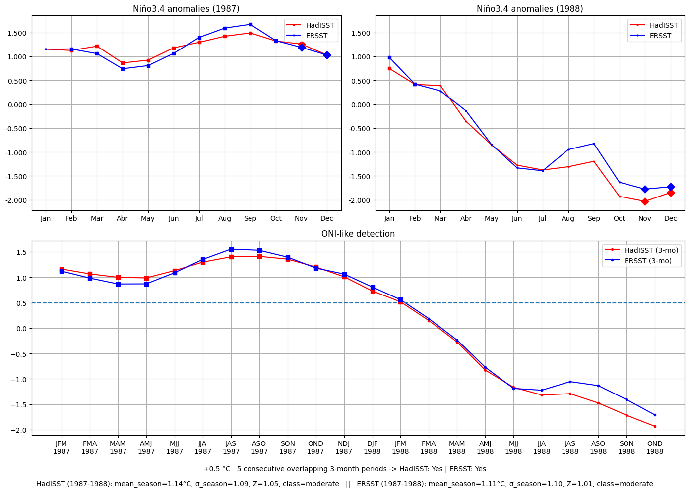

---

Aquí, entre <b>1987 y 1988</b> vemos un evento de <b>Pacific Niño</b> con características
particulares. El episodio cumple holgadamente el criterio del <b>ONI</b>, por lo que se
clasifica como un evento Niño; sin embargo, sus máximos de anomalía no coinciden con los
de un <b>evento canónico</b>.
  

Mientras que en los eventos típicos del ENSO los máximos se concentran en el invierno
boreal, en este caso se observan <b>anomalías positivas persistentes a lo largo de gran
parte del año</b>, aunque con intensidades menores que las registradas en los eventos
más extremos.
  

En particular, las anomalías medias de temperatura en los meses de
<b>noviembre–diciembre</b> alcanzan valores de <b>1.14&nbsp;°C</b> en la base de datos
<b>HADISST</b> y de <b>1.11&nbsp;°C</b> en <b>ERSST</b>, con un índice <b>Z</b> cercano a <b>1</b>,
en el límite de un evento débil, lo que confirma cierta relevancia
térmica del episodio pese a su carácter no canónico.
  

Con el fin de analizar con mayor detalle la estructura temporal completa del evento,
a continuación se representarán los años <b>1986–1987</b> en la siguiente celda, lo que
permitirá visualizar su desarrollo completo y determinar su duración.

---

#Estudio del ENSO entre 1987-1988

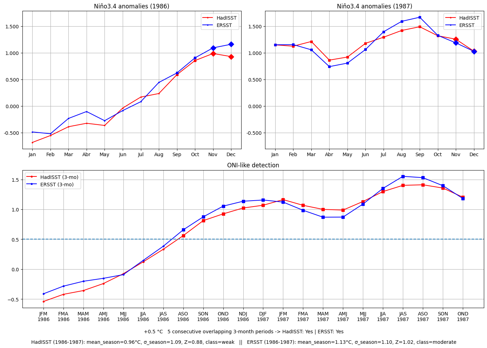

---

A partir de la forma de las anomalías se confirma que el evento se inicia en <b>1986</b> y
finaliza en <b>1988</b>. Se trata de un <b>Pacific Niño</b> peculiar, que se extiende a lo
largo de <b>tres años consecutivos</b> con anomalías positivas.
  

La estructura temporal es, en realidad, similar a la de un evento canónico tanto al
inicio (<b>1986</b>) como al final (<b>1988</b>), con picos de anomalía cercanos a
<b>1&nbsp;°C</b> y valores del índice <b>Z</b> que indican un <b>evento débil</b>.
Lo que distingue a este episodio es que el nivel de anomalía moderada se mantiene de
forma persistente durante todo <b>1987</b>.

---

#Posible ENSO entre 1997-1998

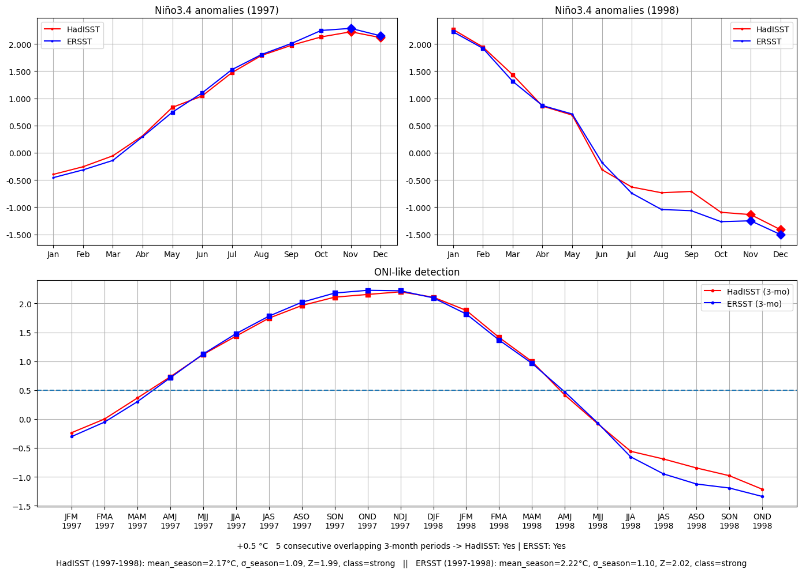

---

Aquí se identifica otro episodio del <b>Pacific Niño</b>, correspondiente al período
<b>1997–1998</b>, de carácter <b>muy intenso</b>.
La anomalía media en los meses de <b>noviembre–diciembre</b> alcanza valores de
<b>2.17&nbsp;°C</b> en <b>HADISST</b> y de <b>2.22&nbsp;°C</b> en <b>ERSST</b>,
muy superiores a su variabilidad típica, lo que da lugar a un índice <b>Z</b>
<b>superior a 2</b>.
  

Este valor sitúa al episodio entre los <b>eventos más fuertes del Pacific Niño</b>
registrados en el período de estudio.

---

#Posible ENSO entre 2015-2016

---

Las anomalías correspondientes al período <b>2015–2016</b> cumplen holgadamente el
criterio del <b>ONI</b> de <b>cinco trimestres móviles consecutivos</b> por encima de
<b>0.5&nbsp;°C</b>.
Se trata de un <b>Pacific Niño</b> especialmente intenso, con una anomalía media en los
meses de <b>noviembre–diciembre</b> de <b>2.32&nbsp;°C</b>.
  

Este episodio constituye el <b>evento de Niño más intenso</b> registrado en el período
<b>1960–2020</b>, con un índice <b>Z</b> superior a <b>2.2</b>, lo que confirma su carácter
extremadamente excepcional.

---

<b>Metodologia para eventos Atlantic Niño</b>  

El <b>Atlantic Niño</b> se caracteriza por presentar su máxima relevancia durante el
<b>verano boreal</b>, a diferencia del <b>Pacific Niño</b>, que es un fenómeno de naturaleza
<b>interanual</b>. El Niño Atlántico no solo presenta una <b>duración considerablemente menor</b>,
sino que también muestra una <b>intensidad ligeramente inferior</b> y un <b>carácter más local</b>,
tal como se ha discutido en apartados anteriores.

En el caso del <b>Niño Atlántico</b>, al tratarse de un fenómeno menos persistente e intenso,
se considera suficiente que se registren <b>al menos tres meses consecutivos</b> con anomalías
superiores a <b>0.4 °C</b> en la región <b>ATL3</b> en el verano.
  

Dado que no es necesario el uso de medias móviles trimestrales, la representación de las
<b>anomalías mensuales</b> resulta adecuada para la identificación del evento.
Además, se incluye la representación de la <b>variabilidad climática característica</b> de la
región, previamente analizada en secciones anteriores. Desde un punto de vista cualitativo,
se espera que, en presencia de un evento, la forma del gráfico reproduzca dicha variabilidad,
pero con una señal térmica claramente destacada durante los meses de máximo desarrollo.

Para caracterizar la <b>intensidad</b> del episodio, se considera la media de las anomalías
en los meses de máximo desarrollo (<b>junio–julio</b>). Al compararla con la
<b>desviación estándar interanual</b> correspondiente a esos mismos meses se obtiene el
índice estandarizado <b>Z</b>, que permite cuantificar de forma objetiva la magnitud del evento.
  

Adicionalmente, dado que el Atlantic Niño es un fenómeno <b>más local y mucho menos influyente</b>
que el <b>ENSO</b>, se introduce una condición adicional: la <b>independencia respecto al ENSO</b>.
Esto implica que debe comprobarse explícitamente la ausencia de un ENSO activo durante el mismo
período de observación. En caso contrario, aun cuando el episodio cumpla los criterios térmicos
y temporales establecidos, el calentamiento observado en el Atlántico debe interpretarse como
una <b>respuesta inducida o modulada por el ENSO</b>, y no como un <b>Atlantic Niño propiamente dicho</b>.

Todos estos cálculos —detección del evento, intensidad y valor de Z— se realizan de forma
consistente para ambas bases de datos empleadas (<b>HADISST</b> y <b>ERSST</b>).

---

#Posible Atlantic Niño en 2010

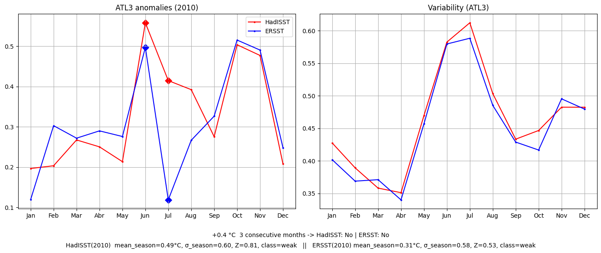

---

En ninguna de las bases de datos se cumple el criterio de
<b>tres meses consecutivos con anomalías positivas superiores a 0.4&nbsp;°C</b>.
Además, la intensidad observada es baja, por lo que el episodio
<b>no cumple los criterios establecidos</b> para ser clasificado como evento.
  

No obstante, en la base de datos <b>HADISST</b> se observan al menos
<b>dos picos consecutivos</b> en los meses esperados, lo que, bajo
criterios menos restrictivos, permitiría considerar este caso como
un <b>Pacific Niño muy débil</b>.

---

#Posible Atlantic Niño en 2016

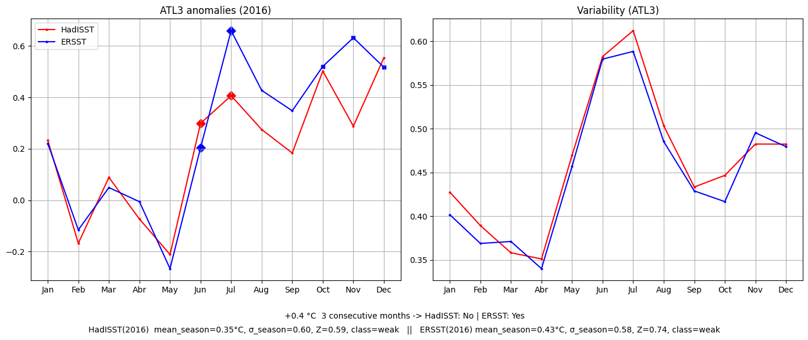

---

Estas anomalías presentan una forma más coherente que en los casos anteriores,
pero los picos son <b>muy poco intensos</b>.
En la base de datos <b>HADISST</b> no se observan ni siquiera
<b>dos picos consecutivos</b> por encima del umbral establecido de <b>0.4&nbsp;°C</b>.
  

En <b>ERSST</b> sí se identifican picos en los meses de <b>julio</b> y <b>agosto</b>
superiores a dicho umbral; sin embargo, estos no cumplen los
<b>requisitos necesarios</b> para confirmar la ocurrencia de un <b>Pacific Niño</b>.

---

#Posible Atlantic Niño en 2018

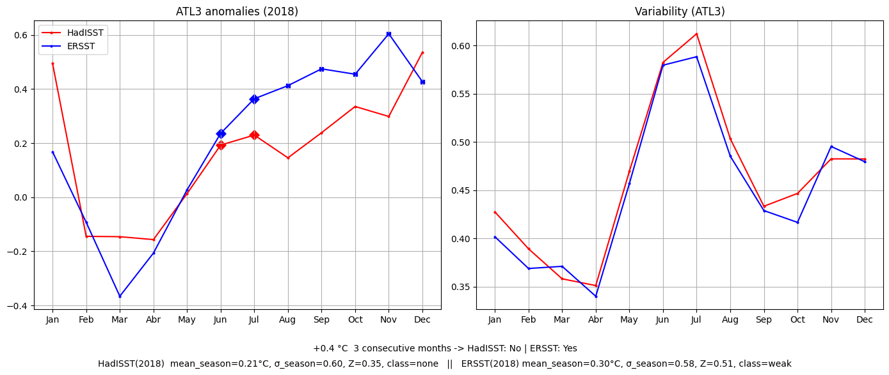

---

Las anomalias de 2018 tienen una forma muy distinta a la esperada y no se cumplen los requistios de 3 meses por encima del umbral de 0.4 C, sus picos son muy poco intensos además con valores inferior al umbral del indice Z =0.5

---

#Posible Atlantic Niño en 2019

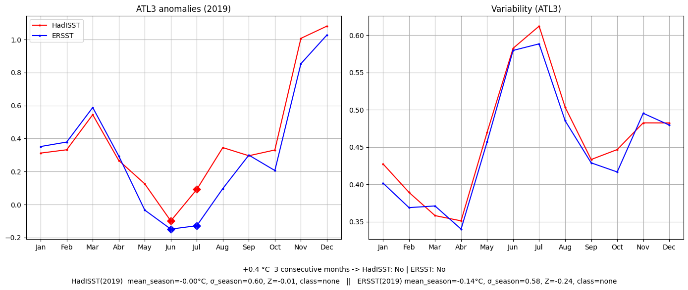

---

Las anomalías de <b>2019</b> presentan una forma totalmente distinta a la esperada.
Aunque se observa un pico elevado a finales de año, este no coincide con la época en la
que debería producirse el máximo en la región ATL3.
Además, en 2019 no se cumple el criterio de <b>tres meses consecutivos</b> con anomalías
superiores al umbral establecido.
  

No obstante, a continuación se analizará <b>2020</b> para evaluar si este caso podría
corresponder a un posible <b>Atlantic Niño interanual</b>.

---

#Posible Atlantic Niño en 2020

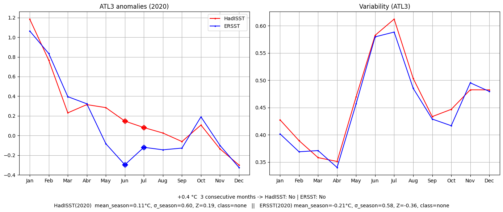

---

Como era de esperar, las anomalías de <b>2020</b> siguen sin asemejarse a la estructura
típica del <b>Atlantic Niño</b>, con valores cercanos a <b>0&nbsp;°C</b> durante el verano boreal.
  

No obstante, si se consideran conjuntamente las anomalías de <b>2019</b> y <b>2020</b>,
podría especularse con la existencia de un episodio cálido entre finales y comienzos de año.
En este caso, el criterio de <b>tres meses consecutivos</b> se cumple, y las anomalías en
dicho intervalo alcanzan valores cercanos a <b>1&nbsp;°C</b>, lo que permitiría clasificarlo,
desde un punto de vista puramente estadístico, como un <b>evento moderado</b> con un
<b>desfase temporal</b>.
  

Sin embargo, el <b>Atlantic Niño</b> se caracteriza por ser un fenómeno
<b>estacional</b>, asociado al <b>verano boreal</b>. Aunque se cumpla la condición temporal
de duración al considerar meses de años consecutivos, no se satisface la
<b>condición física</b> de que el evento se desarrolle durante los meses de verano.
Por este motivo, el episodio <b>no se considera un evento de Atlantic Niño</b>.

Vemos que la selección de eventos de <b>Atlantic Niño</b> no ha identificado
años de estudio tan representativos como en el caso del <b>Pacific Niño</b>.
Esto se debe a que la selección inicial se realizó a partir de
<b>temperaturas medias</b> y no de <b>anomalías</b>, lo que introduce un sesgo hacia los años
más recientes como consecuencia del <b>calentamiento global</b>.
Además, se ha utilizado una <b>media anual</b>, que diluye la señal estacional característica
del Atlantic Niño.
  

En el caso del <b>Pacific Niño</b>, este sesgo es menos relevante, ya que se trata de un
fenómeno más intenso, persistente e interanual, cuyas anomalías dominan claramente sobre
la tendencia de calentamiento global. Incluso al utilizar medias anuales, la señal del
evento sigue siendo representativa de los meses de máximo desarrollo.
Esto no ocurre en el <b>Atlantic Niño</b>, cuya señal es más débil, localizada y fuertemente
estacional.
  

Por este motivo, se procederá a calcular una nueva selección de eventos de Atlantic Niño</b>, y esta nueva selección se basa en dos ajustes principales.
  

<ul>
  <li>
    <strong>Uso de anomalías estacionales en lugar de SST absoluta.</strong> 
    Se emplean anomalías de SST para minimizar el efecto del calentamiento de fondo y evitar
    un sesgo hacia años recientes. Este aspecto es especialmente relevante en el
    Atlantic Niño, cuya señal térmica es más débil y localizada, y no domina la media anual.
    En consecuencia, años con SST anual elevada pueden no corresponder a eventos ATL3
    propiamente dichos.
  </li>

  <li>
    <strong>Selección centrada en los meses de máximo desarrollo.</strong> 
    En lugar de la media anual, se calcula la media de las anomalías durante los meses
    característicos del fenómeno (<strong>junio–julio–agosto, JJA</strong>) y se seleccionan
    los <strong>cinco años con mayor intensidad estacional</strong>.
    Este criterio permite identificar eventos asociados al mecanismo físico del
    Atlantic Niño y descartar anomalías fuera de su ventana estacional. 
  </li>
</ul>

La selección de años del <strong>Pacific Niño</strong> apenas se modifica, lo que pone de
manifiesto la <strong>robustez del criterio original</strong> para este evento. Esta
robustez se explica por el <strong>carácter altamente influyente, intenso e interanual</strong>
del Niño Pacífico, cuyas anomalías dominan la señal climática a escala global durante gran
parte del año. Como consecuencia, incluso al emplear medias anuales, la identificación de
los episodios resulta poco sensible tanto al método de promediado como al
<strong>incremento progresivo del nivel térmico medio asociado al cambio climático</strong>.
Únicamente se excluye el año <strong>1987</strong>, correspondiente al episodio menos canónico,
y se incorpora el año <strong>1965</strong>.
  

Por el contrario, la selección de los años de <strong>Atlantic Niño</strong> cambia de forma
sustancial, confirmando que la identificación basada en <strong>medias anuales de SST</strong>
no es adecuada para este fenómeno. Debido a su <strong>menor intensidad</strong>,
<strong>duración más corta</strong> y <strong>carácter marcadamente estacional</strong>, el Atlantic
Niño es mucho más sensible al método de selección, lo que refuerza la necesidad de un
<strong>enfoque estacional basado en anomalías</strong> para identificar episodios
físicamente consistentes.

---

#Posible ENSO entre 1965-1966

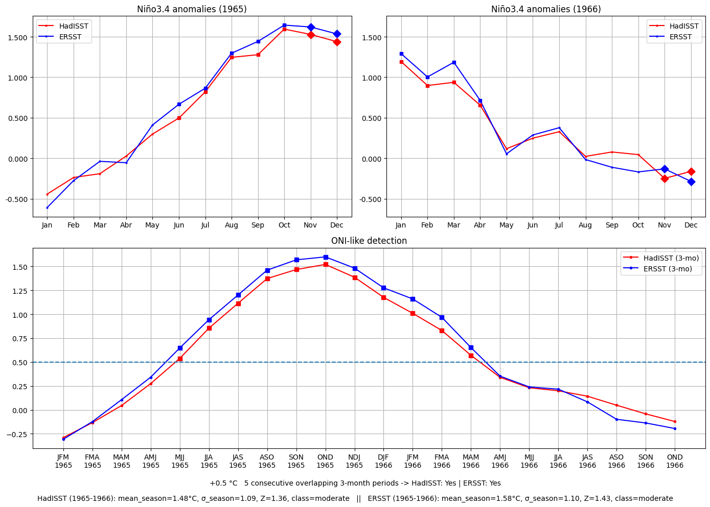

---

Entre <b>1965 y 1966</b> se observa otro <b>Pacific Niño canónico</b>.
La evolución temporal de las anomalías coincide con la forma esperada del fenómeno,
con máximos concentrados a finales de año, y se identifican hasta
<b>11 trimestres móviles consecutivos</b> con anomalías superiores a <b>0.5&nbsp;°C</b>,
cumpliendo ampliamente el criterio del ONI.

La temperatura media en los meses de máximo desarrollo es del orden de
<b>1.5&nbsp;°C</b>, y el índice estandarizado <b>Z</b> alcanza un valor cercano a <b>1.4</b>,
lo que sitúa este episodio en el límite superior de la categoría de
<b>eventos moderados</b> y próximo a ser clasificado como <b>evento fuerte</b>.

Cabe destacar que, aun siendo el episodio <b>menos intenso</b> dentro de este
<b>TOP&nbsp;5</b>, presenta una señal térmica claramente relevante y coherente con
un Pacific Niño de gran magnitud.

---

#Posible Atlantic Niño en 1963

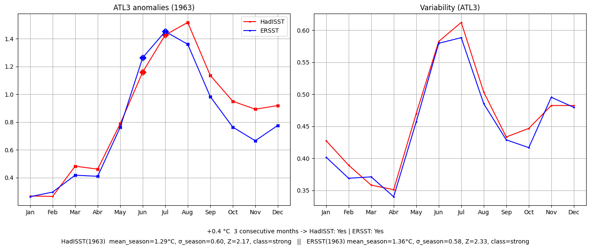

---

Las anomalías correspondientes al año <b>1963</b> cumplen el criterio establecido de
<b>tres meses consecutivos</b> con anomalías superiores a <b>0.4&nbsp;°C</b> en ambas bases
de datos.
La evolución temporal presenta una estructura coherente con un <b>evento canónico</b>,
y la intensidad del episodio es elevada, con valores del índice <b>Z</b> de
<b>2.17</b> para <b>HADISST</b> y <b>2.33</b> para <b>ERSST</b>.
  

Este episodio se sitúa entre los <b>eventos de Atlantic Niño más intensos</b> registrados
en el período <b>1960–2020</b>, con una media de anomalías en los meses de máximo desarrollo
de <b>1.29&nbsp;°C</b> para <b>HADISST</b> y de <b>1.36&nbsp;°C</b> para <b>ERSST</b>.
Estos valores son comparables, en términos de magnitud térmica, a los de algunos eventos
del <b>Pacific Niño</b>, pese a que este último es, en general, más intenso y duradero.
  

Tal como se observa mas adelante en la figura de <b>anomalías globales (Year-Criteria)</b>, las anomalías
asociadas a la región <b>Niño&nbsp;3.4</b> durante 1963 son de <b>menor magnitud</b> y no
presentan una estructura característica de ENSO activo, mientras que el calentamiento en
el <b>Atlántico ecuatorial</b> es dominante y espacialmente coherente.
Esta diferencia de magnitudes refuerza la interpretación de <b>1963</b> como un
<b>Atlantic Niño fuerte e independiente</b>.
  

En conjunto, este caso confirma que la <b>nueva selección estacional basada en anomalías</b>
identifica de forma más consistente los años representativos del <b>Atlantic Niño</b>,
incluso en episodios menos persistentes que los del <b>Pacific Niño</b>.

---

#Posible Atlantic Niño en 1966

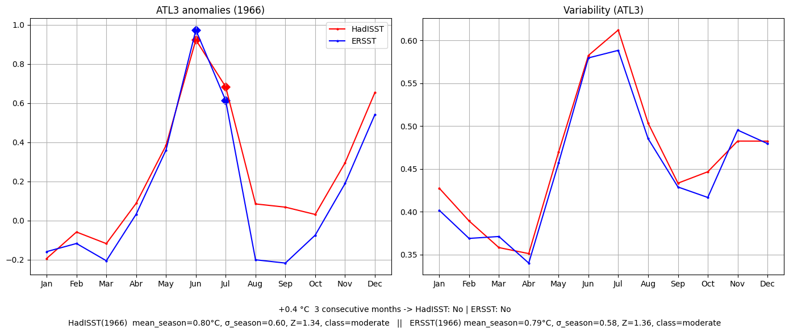

---

En <b>1966</b> se observa un aumento de las anomalías en <b>ATL3</b> durante el
<b>verano boreal</b>, con una intensidad <b>moderada</b>, dado que el índice <b>Z</b> alcanza
valores de <b>1.34</b> en <b>HADISST</b> y <b>1.36</b> en <b>ERSST</b>.
La presencia de picos bien definidos refuerza la interpretación de este episodio como un
posible <b>Atlantic Niño</b>; sin embargo, no se cumple el requisito de
<b>tres meses consecutivos</b> por encima del umbral de <b>0.4&nbsp;°C</b>, debido al
rápido descenso de las anomalías a partir de <b>agosto</b>.
  

Cabe destacar que este episodio se produce durante la fase de debilitamiento del
<b>Pacific Niño 1965–1966</b>. Durante los meses estivales, las anomalías en
<b>Niño&nbsp;3.4</b> son ya reducidas, lo que sugiere que el calentamiento observado en
<b>ATL3</b> no está siendo forzado directamente por un ENSO activo.

Como análisis de sensibilidad, si se considerase un umbral alternativo más laxo
(<b>0.35&nbsp;°C</b>), este episodio cumpliría la condición de duración y podría clasificarse
como un <b>Atlantic Niño canónico</b>, aunque de carácter <b>muy fugaz</b>.

---

#Posible Atlantic Niño en 1968

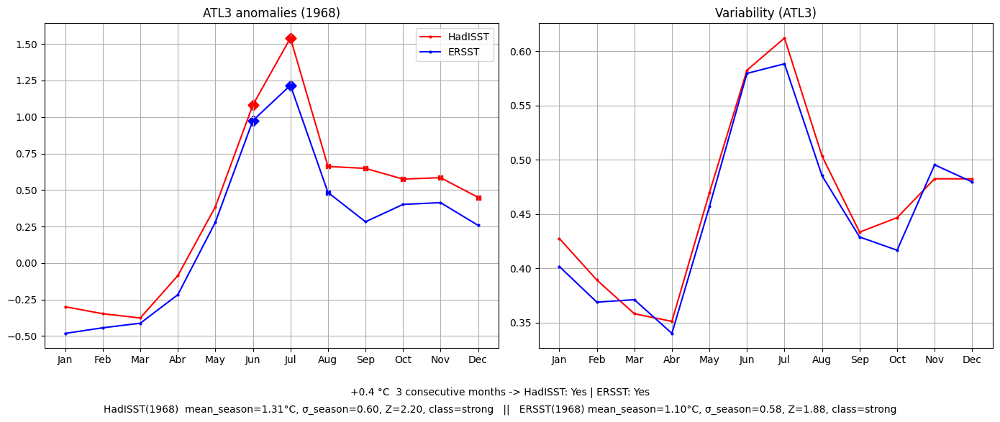

---

Se identifica el <b>Atlantic Niño de 1968</b>, que cumple el criterio de
<b>tres o más meses consecutivos</b> con anomalías superiores a <b>0.4&nbsp;°C</b> durante el
<b>verano boreal</b>.
La intensidad del episodio es elevada, con una temperatura media en los meses de máximo
desarrollo de <b>1.31&nbsp;°C</b> en <b>HADISST</b> y de <b>1.10&nbsp;°C</b> en <b>ERSST</b>,
lo que da lugar a valores del índice <b>Z</b> superiores a <b>2</b> en <b>HADISST</b> y de
<b>1.88</b> en <b>ERSST</b>.
Según la clasificación adoptada, este episodio se considera un <b>evento fuerte</b>.
  

Como se muestra más adelante en la figura de <b>anomalías globales (Year-Criteria)</b>,
no se observan anomalías significativas en la región <b>Niño&nbsp;3.4</b> durante este año,
lo que refuerza la interpretación de <b>1968</b> como un <b>Atlantic Niño independiente</b>,
no asociado a un ENSO activo.

---

#Posible  Atlantic Niño en 1987

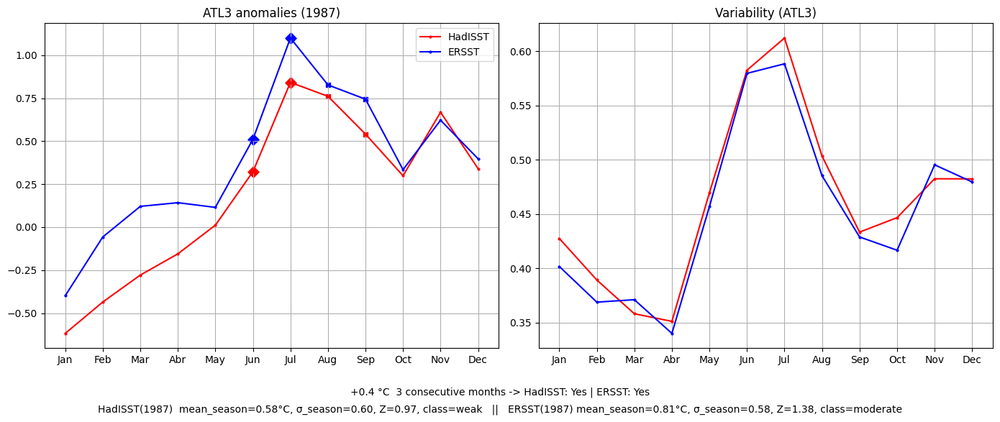

---

El año <b>1987</b> cumple el criterio térmico y temporal definido para la detección de eventos
<b>ATL3</b>; sin embargo, su coincidencia con un <b>Pacific Niño prolongado</b> y su carácter
<b>no canónico</b> sugieren que se trata de un calentamiento atlántico
<b>modulado por ENSO</b>, más que de un <b>Atlantic Niño independiente</b>.
  

Este episodio no forma parte del <b>TOP5</b> de eventos seleccionados, aunque sí se encuentra
entre los años con mayores anomalías en <b>JJ</b>. Se incluye como caso de estudio porque
ilustra que el Atlántico tropical puede responder durante un ENSO activo, lo que constituye
una advertencia metodológica relevante: aun cuando se cumplan los umbrales térmicos y se
obtengan intensidades moderadas, es necesario evaluar el <b>contexto dinámico completo</b>.
  

Por este motivo, en la interpretación final de los resultados se introduce la
<b>independencia respecto al ENSO</b> como un <b>criterio adicional de clasificación</b>,
utilizado para distinguir entre eventos atlánticos genuinos y calentamientos inducidos
o modulados por el Pacific Niño.
En consecuencia, para <b>todos los años en los que se declare un Atlantic Niño</b>,
resulta necesario comprobar explícitamente si existe o no un <b>ENSO activo</b> en el
Pacífico, con el fin de evitar la identificación de <b>falsos positivos</b> y asegurar
una interpretación físicamente consistente de los eventos detectados.

---

#Posible Atlantic Niño en 1988

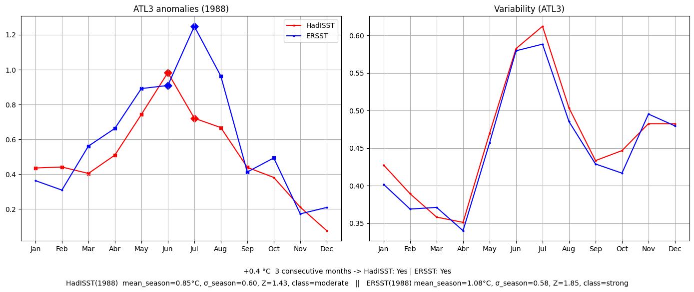

---

A diferencia de <b>1987</b>, el episodio de <b>1988</b> presenta una <b>estructura estacional
bien definida</b>, con máximos concentrados en el <b>verano boreal</b> y anomalías que superan
claramente la variabilidad climatológica.
Además, el evento se desarrolla una vez finalizado el <b>Pacific Niño 1986–1988</b>, lo que
reduce la probabilidad de un forzamiento directo por ENSO y refuerza su interpretación como
un <b>Atlantic Niño propiamente dicho</b>.
  

La intensidad del episodio se sitúa entre <b>moderada y fuerte</b>, dependiendo de la base de
datos considerada.
Aunque <b>ERSST</b> tiende a presentar valores ligeramente superiores a <b>HADISST</b>, en este
caso la diferencia es más acusada, con una discrepancia entre medias superior a
<b>0.2&nbsp;°C</b>.
El índice <b>Z</b> alcanza valores de <b>1.43</b> en <b>HADISST</b> y de <b>1.85</b> en
<b>ERSST</b>, confirmando la relevancia del episodio.

---

#Posible Atlantic Niño en 1996

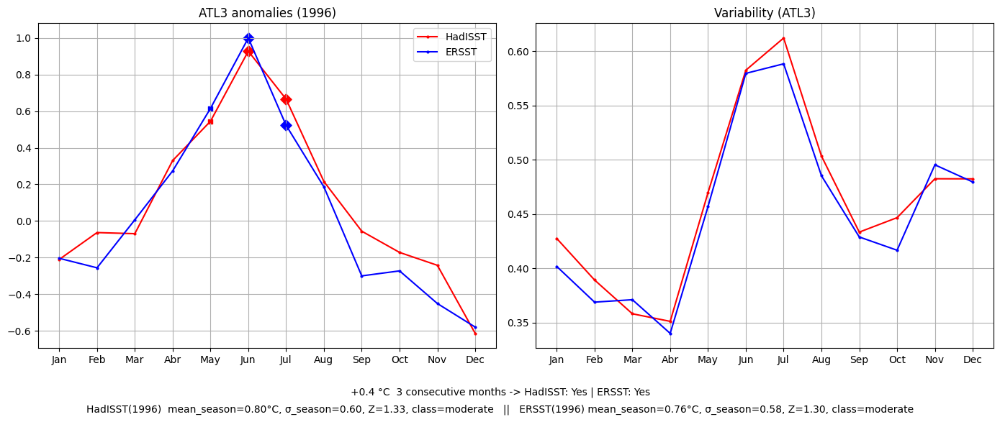

---

En <b>1996</b> se observa un caso <b>típico de Atlantic Niño</b>.
Se cumplen las condiciones de <b>tres meses consecutivos</b> con anomalías superiores a
<b>0.4&nbsp;°C</b>, y la intensidad del evento es <b>moderada</b>.
Ambas bases de datos muestran una evolución muy similar, lo que refuerza la
<b>coherencia y robustez</b> de la señal observada.
  

Asimismo, en la figura <b>“Year-Criteria”</b> se aprecia que las anomalías en el
<b>Pacífico</b> durante 1996 son <b>insignificantes</b>, lo que confirma que este
<b>Atlantic Niño</b> puede considerarse un <b>evento independiente</b>, no forzado por
un ENSO activo.

Esta función integra <b>dos funcionalidades principales</b>:
  

<ul>
  <li>
    <b>Representación de anomalías globales.</b> 
    Permite visualizar las <b>anomalías de SST a escala global</b> correspondientes a
    <b>cuatro eventos diferentes</b> (cuatro años distintos) en un conjunto de
    <b>meses seleccionados</b>.
    Es posible elegir la <b>base de datos</b>, los <b>años a analizar</b>, los
    <b>meses de interés</b> y la <b>escala de colores</b>, lo que facilita la comparación
    gráfica de la intensidad relativa de los eventos estudiados.
    Este tipo de representación muestra todas las anomalías presentes en cada año, no solo
    las asociadas al evento principal, lo que permite identificar casos como <b>1987</b>,
    donde coexistía un <b>ENSO prolongado</b> junto con anomalías en la región <b>ATL3</b>.
  </li>
   

  <li>
    <b>Generación de animaciones (GIF).</b> 
    Reproduce una animación que muestra la <b>evolución temporal de las anomalías</b>
    mes a mes, utilizando <b>dos meses por fotograma</b>.
    Para eventos de <b>Atlantic Niño</b>, la selección de <b>un solo año</b> es suficiente;
    en este caso, basta con introducir el año de estudio como <b>año 1</b> y asignar
    un valor <b>0</b> al <b>año 2</b>.
    En el caso del <b>ENSO</b>, donde el desarrollo es <b>interanual</b>, se deben indicar
    dos años consecutivos.
    Los parámetros <b>año 3</b>, <b>año 4</b> y la selección de meses no son relevantes
    para la generación del GIF.
  </li>
</ul>

---

#Figura YEAR-CRITERIA  

![Plot_global_mean_anoms_with_Z("a", 1963, 1968, 1987, 1996, months_sel=[5,6], min_abs_temp=1.5, event=None) ](img/28.png)

---

Esta es la figura <b>YEAR-CRITERIA</b>, construida a partir de la base de datos
<b>HADISST</b>, y utilizada para evaluar si, durante los años de estudio del
<b>Atlantic Niño</b>, se observa la presencia de un <b>ENSO activo</b> en el Pacífico.
  

En primer lugar, se muestra el caso de <b>1963</b>, en el que se aprecian
<b>anomalías positivas débiles</b> en la región <b>Niño&nbsp;3.4</b> que podrían sugerir la
existencia de un ENSO incipiente.
No obstante, las anomalías en el <b>Atlántico ecuatorial</b> son claramente de
<b>mayor magnitud</b>, lo que confirma que el evento dominante ese año corresponde a un
<b>Atlantic Niño fuerte</b>, mientras que la señal en el Pacífico se interpreta como una
<b>perturbación secundaria</b>.
  

A continuación, se presenta el año <b>1987</b>, donde sí se observa de forma clara un
<b>Pacific Niño activo</b>, reflejado en anomalías significativas en el Pacífico ecuatorial.
Este caso ilustra un escenario en el que el Atlántico puede responder durante un ENSO
prolongado, dando lugar a un evento <b>no independiente</b>.
  

Finalmente, se muestran los años <b>1996</b> y <b>1968</b>, en los que no se identifican
anomalías positivas relevantes en el Pacífico, confirmando la ausencia de un ENSO activo.
Estos años constituyen ejemplos de <b>Atlantic Niño independientes</b>, no forzados por la
variabilidad del Pacífico.

---

#Altanic Niño en 1960-1996-1968-1963

![Plot_global_mean_anoms_with_Z("b", 1960,1996 ,1968 ,1963 , [5,6], min_abs_temp=1.5)](img/29.png)

---

En esta figura se comparan, utilizando la base de datos <b>ERSST</b>, distintos
<b>eventos de Atlantic Niño</b> representados durante los meses de <b>junio–julio</b>,
con el objetivo de evaluar su intensidad y extensión espacial.
  

<ul>
  <li>
    <b>Primera imagen (1960).</b> 
    Corresponde a un <b>año neutral</b>, sin anomalías destacables en el Atlántico
    ecuatorial. El índice <b>Z</b> es cercano a <b>0</b>, lo que confirma la ausencia de
    un evento Atlantic Niño.
  </li>
   

  <li>
    <b>Segunda imagen (1996).</b> 
    Muestra un <b>Atlantic Niño moderado</b>, caracterizado por un índice
    <b>Z ≈ 1.3</b>. El calentamiento es visible en la región <b>ATL3</b>, pero no destaca
    de forma significativa a escala global frente a otras anomalías presentes en
    distintas áreas.
  </li>
   

  <li>
    <b>Tercera imagen (1968).</b> 
    Corresponde a un <b>Atlantic Niño fuerte</b>, con un índice
    <b>Z ≈ 1.88</b>. El calentamiento es intenso pero <b>muy focalizado</b> en el Atlántico
    ecuatorial, con una extensión espacial limitada.
  </li>
   

  <li>
    <b>Cuarta imagen (1963).</b> 
    Representa el <b>evento más intenso</b> del conjunto analizado, con un índice
    <b>Z ≈ 2.33</b>. En este caso, las anomalías son <b>más amplias y más intensas</b>,
    dominando claramente la señal térmica en el Atlántico ecuatorial.
  </li>
</ul>

---

![Plot_global_mean_anoms_with_Z("a", 1963, 0, 1972, 2015, months_sel=[10,11], min_abs_temp=2, event="Atlantic Niño")](gif/1.gif)

---

El GIF, construido a partir de la base de datos <b>HADISST</b>, muestra la
<b>evolución temporal del Atlantic Niño de 1963</b>, permitiendo seguir mes a mes el
desarrollo espacial de las anomalías de SST.
Se observa claramente cómo los <b>máximos de anomalía se concentran durante el verano
boreal</b>, en coherencia con la estacionalidad característica del fenómeno en la región
<b>ATL3</b>.
Este evento se ha seleccionado de manera ilustrativa porque presenta el
<b>índice Z más elevado</b> de todos los casos analizados (<b>Z ≈ 2.2</b>), lo que facilita
una identificación visual clara del fenómeno y de su estructura espacial.
  

Además, junto al máximo atlántico en <b>JJ</b>, se aprecia un <b>ligero calentamiento
simultáneo</b> en la región <b>Niño&nbsp;3.4</b>, que se refuerza posteriormente hacia
<b>ND</b>. Dado que la magnitud de las anomalías en el Pacífico es sensiblemente menor que
la observada en el Atlántico, este patrón sugiere que el <b>Atlantic Niño</b> podría haber
actuado como un <b>mecanismo de modulación o precondicionamiento</b> del Pacífico, más que
como un ENSO plenamente desarrollado.
  

Esta evolución es compatible con una respuesta retardada del Pacífico a perturbaciones
atmosféricas inducidas en el Atlántico, posiblemente a través de modificaciones en la
circulación de Walker. No obstante, esta relación se interpreta como una
<b>hipótesis física plausible</b> y no como evidencia concluyente de un forzamiento directo.

---

#Pacific Niño en 1960-1987-1972-2015

![Plot_global_mean_anoms_with_Z("a", 1960, 1987, 1972, 2015, months_sel=[10,11], min_abs_temp=3)](img/29.png)

---

En esta figura se comparan, utilizando la base de datos <b>HADISST</b>, distintos
<b>eventos de Pacific Niño</b> representados durante los meses de
<b>noviembre–diciembre</b>, con el objetivo de evaluar su intensidad y extensión espacial.
  

<ul>
  <li>
    <b>Primera imagen (1960).</b> 
    Corresponde a un <b>año neutral</b>, sin anomalías destacables en el Pacífico
    ecuatorial. El índice <b>Z</b> es cercano a <b>0</b>, lo que confirma la ausencia de
    un <b>ENSO</b> activo durante ese año.
  </li>
   

  <li>
    <b>Segunda imagen (1987).</b> 
    Muestra un <b>Pacific Niño débil a moderado</b>, correspondiente al caso de un
    <b>Niño prolongado</b>, en el que las anomalías positivas se mantienen a lo largo del
    año, debilitándose progresivamente hacia <b>1988</b>.
    La característica <b>lengua cálida</b> sobre el Pacífico ecuatorial es visible,
    aunque menos intensa que en eventos canónicos fuertes.
  </li>
   

  <li>
    <b>Tercera imagen (1972).</b> 
    Corresponde a un <b>Pacific Niño fuerte</b>, con un índice
    <b>Z ≈ 1.78</b>.
    Las anomalías de temperatura en la región del Pacífico ecuatorial son
    significativamente más intensas que en el caso anterior, situando a este episodio
    entre los <b>Niños más intensos</b> del periodo analizado.
  </li>
   

  <li>
    <b>Cuarta imagen (2015).</b> 
    Representa el <b>Pacific Niño más intenso</b> de la muestra de datos, con un índice
    <b>Z ≈ 2.13</b>.
    En este caso, las anomalías son más extensas e intensas que en <b>1972</b>, aunque
    la diferencia entre ambos eventos no es extremadamente grande en términos espaciales.
  </li>
</ul>

---

![Plot_global_mean_anoms_with_Z("a", 2015, 2016, 1972, 2015, months_sel=[10,11], min_abs_temp=3, event="Pacific Niño")](gif/2.gif)

---

El GIF, construido a partir de la base de datos <b>HADISST</b>, muestra la
<b>evolución temporal del Pacific Niño de 2015</b>, permitiendo seguir mes a mes el
desarrollo espacial de las anomalías de SST en la región <b>Niño&nbsp;3.4</b>.
Se observa claramente cómo los <b>máximos de anomalía se concentran en el invierno boreal</b>,
en coherencia con la estacionalidad característica de los eventos <b>ENSO</b>.
  

Este evento se ha seleccionado de manera ilustrativa porque presenta el
<b>índice Z más elevado</b> del periodo analizado (<b>Z ≈ 2.13</b>), lo que facilita una
identificación visual clara del fenómeno y de su estructura espacial.
Durante el pico del evento, las <b>anomalías térmicas alcanzan valores superiores a
<b>2&nbsp;°C</b></b>, evidenciando la magnitud excepcional del calentamiento y confirmando
su clasificación como uno de los <b>Pacific Niño más intensos</b> registrados.

